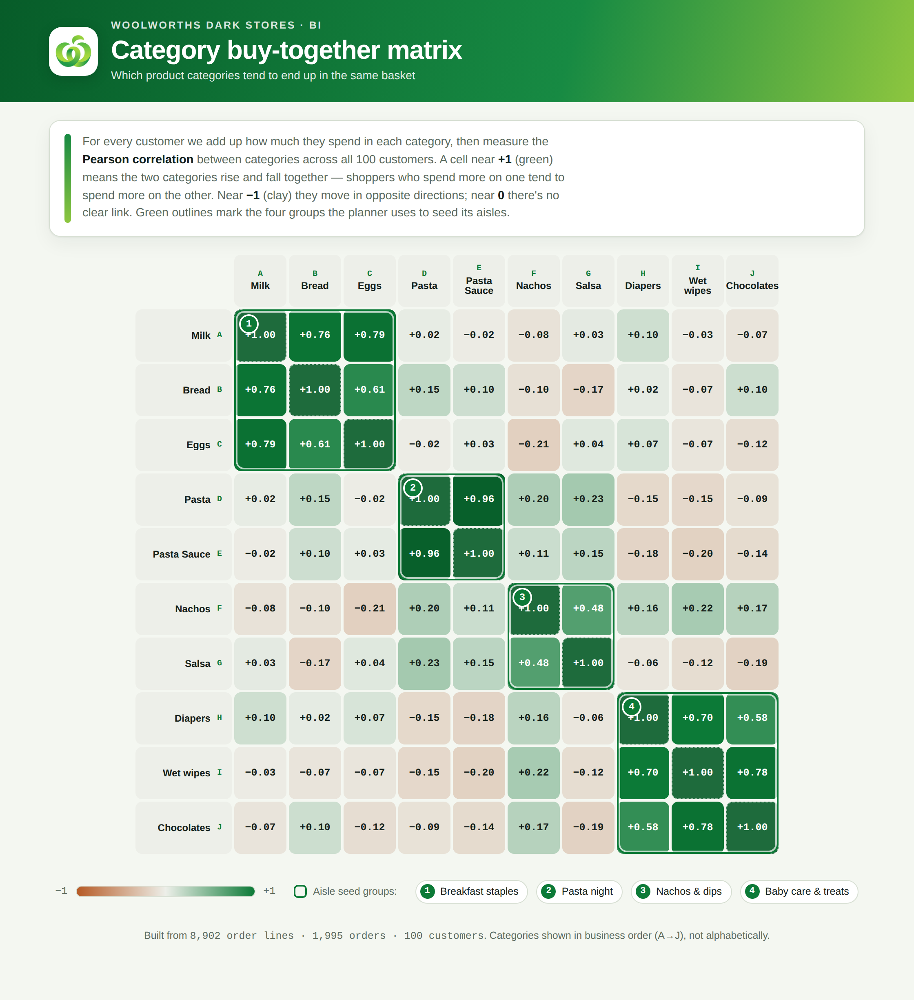
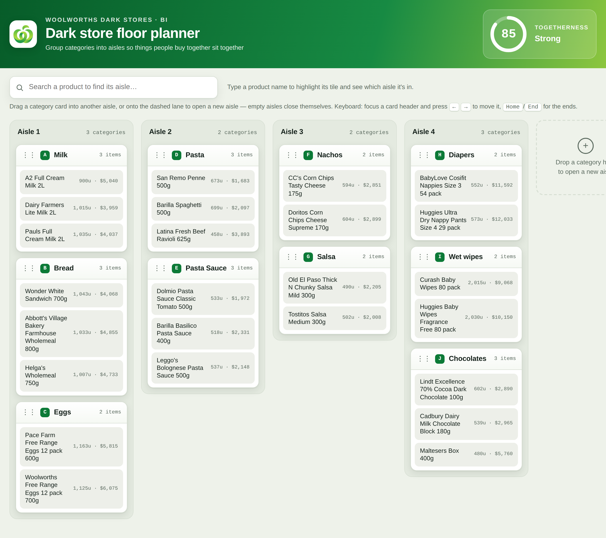

# Woolworths Dark Store Shelf Planner

**Live demo:** [Interactive floor planner](https://kurian11.github.io/woolworths-dark-store-planner/woolworths_floor_planner.html) · [Buy-together heatmap](https://kurian11.github.io/woolworths-dark-store-planner/woolworths_correlation_matrix.html)
Two interactive BI tools that turn a raw retail order file into an aisle-layout decision for a **dark store** (a micro-fulfilment warehouse that picks online grocery orders). The goal: put categories that customers *buy together* physically *close together*, so pickers walk less per order.

**Stack:** Python (pandas, SciPy) for the analysis · vanilla JavaScript + HTML/CSS for the tools · no front-end framework, no charting library, no build step.

> Independent, self-directed project. Not affiliated with or endorsed by Woolworths; the logo and green theme are used only to set the brief. The dataset is a sample of retail order lines, not real Woolworths data.

---

## The problem

In a dark store, layout is an operations lever: the further apart two frequently co-purchased categories sit, the more a picker walks to assemble a basket. So the question isn't "what sells most" — it's **which categories belong in the same aisle**. I approached it as a small end-to-end BI build: measure buy-together strength from transactions, seed a sensible starting layout, then hand planners a tool to adjust it and see the trade-off live.

## Deliverables

| File | What it is |
|------|------------|
| `woolworths_correlation_matrix.html` | Category **buy-together heatmap** — a 10×10 Pearson correlation matrix with the values printed in every cell and the four seed groups outlined on the diagonal. |
| `woolworths_floor_planner.html` | Interactive **floor planner** — categories seeded into aisles from the clustering; drag a category to another aisle (or onto an empty lane to open a new one) and a **togetherness score** recalculates live. A search box finds any product and names its aisle. |





## Data

A single sheet of order lines — `order_id, cust_id, customer_name, product_name, product_category, quantity, unit_price`.

- **8,902** order lines · **1,995** orders · **100** customers · **25** products across **10** categories
- `spend = quantity × unit_price`
- Categories carry an `A.`–`J.` prefix that encodes the intended **business order** (staples → pasta → snacks → baby care), which I preserved everywhere instead of sorting alphabetically.

## Approach

1. **Buy-together strength.** For each customer, sum spend per category → a 100 × 10 customer-by-category matrix. Compute **Pearson correlation** between category columns, so "buy together" means two categories' spend rises and falls together across the customer base.
2. **Seed the aisles.** Convert correlation to distance (`1 − r`) and run **average-linkage hierarchical clustering**, cut at **k = 4**. This recovers four intuitive shopping missions:
   - Milk · Bread · Eggs (breakfast staples)
   - Pasta · Pasta Sauce (`r = 0.96`)
   - Nachos · Salsa
   - Diapers · Wet wipes · Chocolates — the tired-parent basket, where chocolates track baby care rather than staples.
3. **Togetherness score (0–100).** Take every pair of categories that share an aisle, average their Pearson `r`, and map it linearly: `score = (mean r + 1) / 2 × 100`. So `r = +1 → 100`, `0 → 50`, `−1 → 0`; a layout with nothing grouped scores 0. The seed layout scores **85**, and the number moves the instant you drag a card.
4. **Product order inside a card.** Products within a category are seriated by their own spend correlation, so the most-correlated products stack next to each other.

## Decisions & assumptions

The judgment calls mattered as much as the maths — each is documented in the tools:

- **Duplicate order lines (496 of them) are kept, not dropped.** There's no line ID to separate a data error from a genuine repeat line, so removing them would be inventing a judgment about the data. They sum into spend.
- **Zeros are real.** A few customers bought nothing in a category (e.g. Eggs 99/100, Nachos/Salsa 96/100). These are treated as genuine £0 spend — no imputation.
- **Correlation is on total category spend per customer**, capturing spend co-movement across the customer base rather than same-basket co-occurrence.
- **Light theme is locked** in both tools — a diverging heatmap needs a stable colour reference.

## Build notes

- **Self-contained single files.** Data and logo are embedded; the pages make no external calls and load no libraries — they open straight from disk.
- **Accessible.** WCAG AA contrast, visible keyboard focus, full keyboard operation of the planner (focus a card, use ←/→ and Home/End), ARIA labels and live announcements on every move.
- **Custom drag-and-drop** built on Pointer Events, so it works with mouse, touch and pen — not just desktop HTML5 drag.
- **Responsive** down to mobile (aisles stack, the gauge reflows).

## What this project demonstrates

- Exploratory analysis and **correlation** on transactional data
- **Unsupervised clustering** (hierarchical) used for a concrete operational decision
- Translating a statistic into a **metric a non-technical planner can act on**
- **Data-visualisation design** — a readable diverging heatmap and a live scoring interface
- **Front-end / BI engineering** with accessibility and cross-device input handled from scratch
- **Product thinking** — scoping to one score, one search, no clutter, and documenting every assumption

## Run it

Open either `.html` file in any modern browser — they're self-contained, so nothing to install.

### Reproduce the analysis

The HTML files embed the output of `analysis.py`. To regenerate or verify it:

```bash
pip install -r requirements.txt
python analysis.py
```

This reads `data/Woolies_dark_stores_shelf_planner_-_Data.xlsx`, recomputes the correlation matrix, seed aisles and product stats, and writes `data.json` (the exact object embedded in the two pages). Expected output: seed togetherness **85/100** and the four aisles listed above.

### Repo layout

```
woolworths-dark-store-planner/
├── README.md
├── analysis.py                     # correlation + clustering + stats
├── requirements.txt
├── woolworths_correlation_matrix.html
├── woolworths_floor_planner.html
├── data/
│   └── Woolies_dark_stores_shelf_planner_-_Data.xlsx
└── images/
    ├── matrix-preview.png
    └── planner-preview.png
```

---

### Short blurb (for a portfolio index or LinkedIn)

> **Woolworths Dark Store Shelf Planner** — Built two self-contained BI tools that turn a retail order file into a warehouse aisle layout: a Pearson buy-together heatmap and an interactive floor planner where dragging categories between aisles updates a live "togetherness" score. Hierarchical clustering seeds the initial aisles; vanilla JS, fully accessible, no frameworks.
